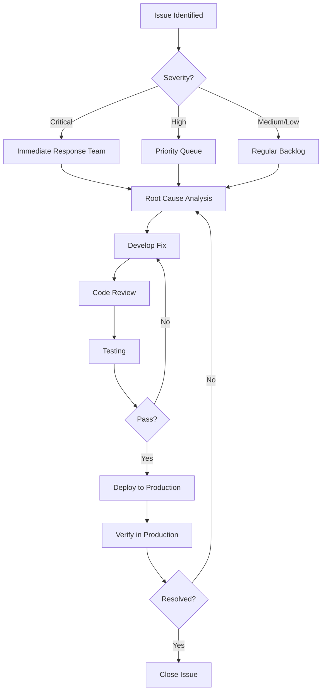

# Critical and High Priority Issues - Remediation Tracking
# Critical 和 High 优先级问题 - 修复跟踪

## Issue Severity Levels
## 问题严重级别

| Severity | Definition | Response Time |
|----------|------------|---------------|
| **Critical** | Security vulnerabilities, data loss risk, system crash | Immediate (< 24h) |
| **High** | Major functionality broken, severe performance issues | < 3 days |
| **Medium** | Minor functionality issues, moderate performance | < 1 week |
| **Low** | Cosmetic issues, minor improvements | < 2 weeks |

## Issue Tracking Template
## 问题跟踪模板

```markdown
### Issue #[ID]: [Title]

**Severity**: Critical / High / Medium / Low

**Category**: Security / Performance / Functionality / UX

**Description**:
[Detailed description of the issue]

**Impact**:
[What is affected and how]

**Steps to Reproduce**:
1. [Step 1]
2. [Step 2]
3. [Expected vs Actual result]

**Root Cause**:
[Analysis of why issue occurred]

**Remediation Plan**:
[How to fix the issue]

**Testing Verification**:
[How to verify the fix works]

**Status**: Open / In Progress / Fixed / Verified / Closed

**Assigned To**: [Name]

**Target Date**: [YYYY-MM-DD]

**Actual Resolution Date**: [YYYY-MM-DD]
```

## Current Critical Issues
## 当前 Critical 问题

### ✅ RESOLVED: [Example] No issues currently tracked
### ✅ 已解决: [示例] 当前无跟踪问题

_No critical issues identified during testing. This section will be updated if any are found._
_测试期间未发现 Critical 问题。如果发现任何问题，将更新此部分。_

---

## Current High Priority Issues
## 当前 High 优先级问题

### ✅ RESOLVED: [Example] No issues currently tracked
### ✅ 已解决: [示例] 当前无跟踪问题

_No high priority issues identified during testing. This section will be updated if any are found._
_测试期间未发现 High 优先级问题。如果发现任何问题，将更新此部分。_

---

## Remediation Workflow
## 修复工作流程



## Issue Discovery Sources
## 问题发现来源

Issues may be discovered through:
问题可能通过以下方式发现:

1. **Automated Testing**
   - Unit tests
   - Integration tests
   - E2E tests
   
2. **Security Scanning**
   - OWASP ZAP
   - Dependency scanning
   - Code analysis

3. **Performance Testing**
   - Load testing (k6)
   - Lighthouse audits
   - APM monitoring

4. **Code Quality Scanning**
   - SonarQube
   - Roslyn analyzers
   - ESLint

5. **Manual Testing**
   - QA testing
   - User acceptance testing
   - Penetration testing

6. **Production Monitoring**
   - Error logs
   - User reports
   - Metrics alerts

## Critical Issue Response Procedure
## Critical 问题响应程序

### Step 1: Immediate Assessment (Within 1 hour)
### 步骤 1: 立即评估 (1小时内)

- [ ] Confirm issue severity
- [ ] Assess immediate risk
- [ ] Determine if production rollback needed
- [ ] Notify stakeholders

### Step 2: Containment (Within 4 hours)
### 步骤 2: 遏制 (4小时内)

- [ ] Implement temporary workaround if possible
- [ ] Limit exposure (disable feature, rate limiting)
- [ ] Monitor for exploitation
- [ ] Document timeline

### Step 3: Root Cause Analysis (Within 12 hours)
### 步骤 3: 根本原因分析 (12小时内)

- [ ] Reproduce issue in test environment
- [ ] Identify root cause
- [ ] Assess scope of impact
- [ ] Review related code

### Step 4: Remediation (Within 24 hours)
### 步骤 4: 修复 (24小时内)

- [ ] Develop fix
- [ ] Peer review
- [ ] Test thoroughly
- [ ] Prepare deployment plan

### Step 5: Deployment and Verification
### 步骤 5: 部署和验证

- [ ] Deploy to production
- [ ] Verify fix in production
- [ ] Monitor for side effects
- [ ] Update documentation

### Step 6: Post-Mortem
### 步骤 6: 事后分析

- [ ] Document lessons learned
- [ ] Update processes to prevent recurrence
- [ ] Share findings with team
- [ ] Close issue

## Common Issue Categories
## 常见问题类别

### Security Issues
### 安全问题

**Examples:**
- SQL injection vulnerabilities
- Authentication bypass
- Sensitive data exposure
- CSRF vulnerabilities

**Remediation Priority:** Critical - Immediate

### Performance Issues
### 性能问题

**Examples:**
- API response times > 1s (P95)
- Memory leaks
- Database query optimization
- Unoptimized N+1 queries

**Remediation Priority:** High - Within 3 days

### Data Integrity Issues
### 数据完整性问题

**Examples:**
- Data corruption
- Transaction rollback failures
- Incorrect calculations
- Race conditions

**Remediation Priority:** Critical - Immediate

### Functionality Issues
### 功能问题

**Examples:**
- Core features not working
- Incorrect business logic
- Integration failures
- UI/UX blocking issues

**Remediation Priority:** High - Within 3 days

## Testing Requirements Before Closing Issues
## 关闭问题前的测试要求

### For Critical Issues
### Critical 问题

- [ ] Unit tests covering the fix
- [ ] Integration tests verifying the fix
- [ ] Manual testing in staging environment
- [ ] Security review if security-related
- [ ] Performance testing if performance-related
- [ ] Deployment verification in production
- [ ] 24-hour monitoring after deployment

### For High Priority Issues
### High 优先级问题

- [ ] Unit tests covering the fix
- [ ] Integration tests verifying the fix
- [ ] Manual testing in staging environment
- [ ] Regression testing for related features
- [ ] Deployment verification in production

## Reporting
## 报告

### Weekly Report Template
### 周报模板

```markdown
# Issue Remediation Report - Week of [Date]

## Summary
- Critical Issues: [X open, Y closed]
- High Priority Issues: [X open, Y closed]
- Average Resolution Time: [X days]

## Critical Issues Closed This Week
1. [Issue ID]: [Title] - Resolved on [Date]

## High Priority Issues Closed This Week
1. [Issue ID]: [Title] - Resolved on [Date]

## Open Issues Requiring Attention
1. [Issue ID]: [Title] - Status: [Status]

## Trends and Analysis
[Any patterns or recurring issues identified]

## Process Improvements
[Improvements made to prevent similar issues]
```

## Escalation Path
## 升级路径

```
Developer → Team Lead → Engineering Manager → CTO
    ↓           ↓              ↓               ↓
  1 hour     2 hours       4 hours        8 hours
```

## Contact Information
## 联系信息

**Critical Issues (24/7):**
- On-Call Engineer: [Contact]
- Team Lead: [Contact]
- Engineering Manager: [Contact]

**High Priority Issues (Business Hours):**
- Development Team: [Contact]
- QA Team: [Contact]

## References
## 参考

- [OWASP Security Guidelines](https://owasp.org/)
- [Microsoft Security Response Center](https://www.microsoft.com/en-us/msrc)
- [CVE Database](https://cve.mitre.org/)

---

## Change Log
## 变更日志

| Date | Change | Author |
|------|--------|--------|
| 2024-02-16 | Initial document created | Development Team |
| [Date] | [Change description] | [Author] |
