# Lean WebUI - Architecture Diagrams and Flowcharts

This document contains architecture diagrams, data flow diagrams, and sequence diagrams for the Lean WebUI system.

> **Related Documentation**:
> - Developer Guide: [WebUI-Developer-Guide.md](./WebUI-Developer-Guide.md)
> - API Reference: [WebUI-API-Reference.md](./WebUI-API-Reference.md)
> - User Guide: [WebUI-User-Guide.md](./WebUI-User-Guide.md)

---

## Table of Contents

1. [System Architecture](#1-system-architecture)
2. [Component Diagrams](#2-component-diagrams)
3. [Data Flow Diagrams](#3-data-flow-diagrams)
4. [Sequence Diagrams](#4-sequence-diagrams)
5. [Deployment Diagrams](#5-deployment-diagrams)
6. [Database Schema](#6-database-schema)

---

## 1. System Architecture

### 1.1 High-Level Architecture

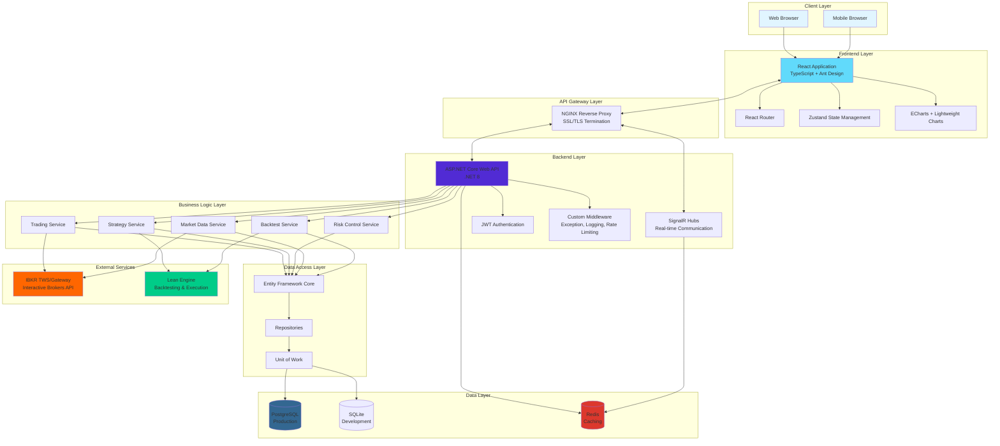

### 1.2 Layered Architecture

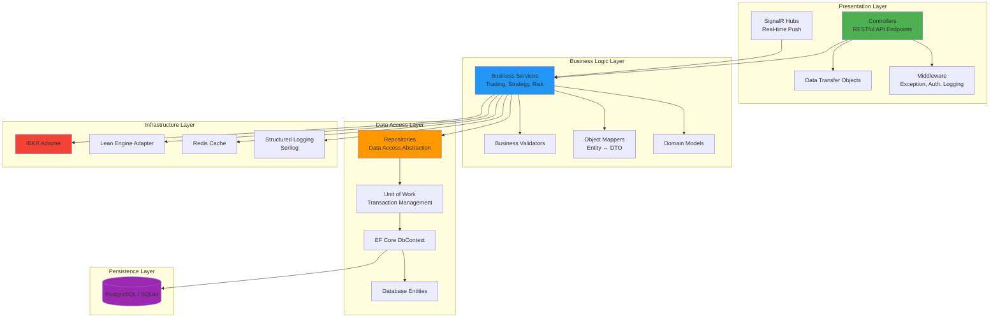

---

## 2. Component Diagrams

### 2.1 Frontend Structure

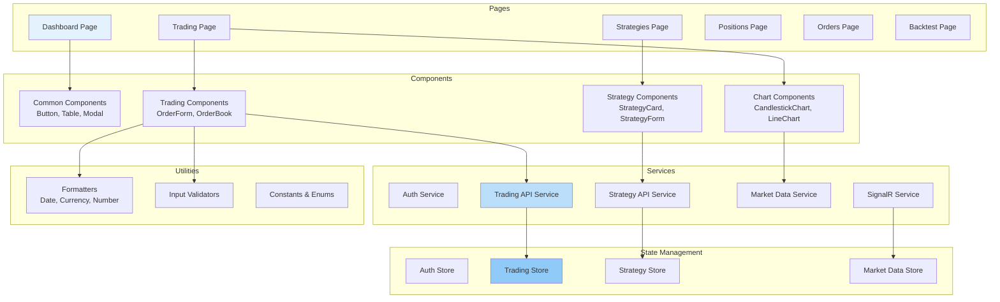

### 2.2 Backend Services

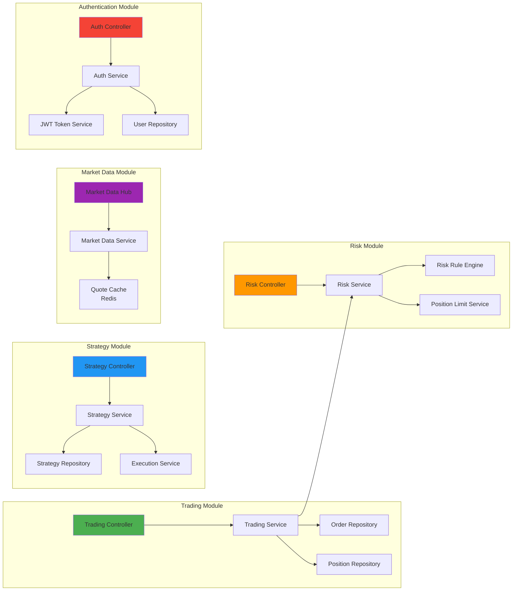

---

## 3. Data Flow Diagrams

### 3.1 Order Placement Flow

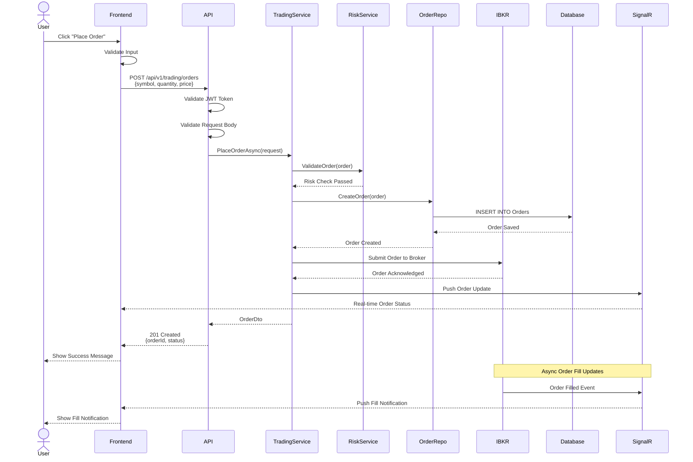

### 3.2 Strategy Execution Flow

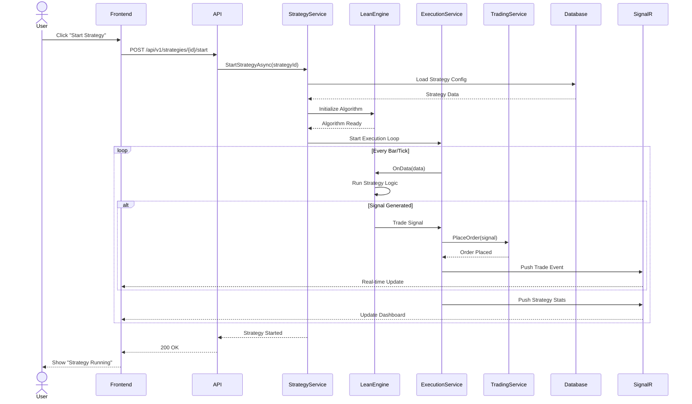

### 3.3 Real-time Market Data Flow

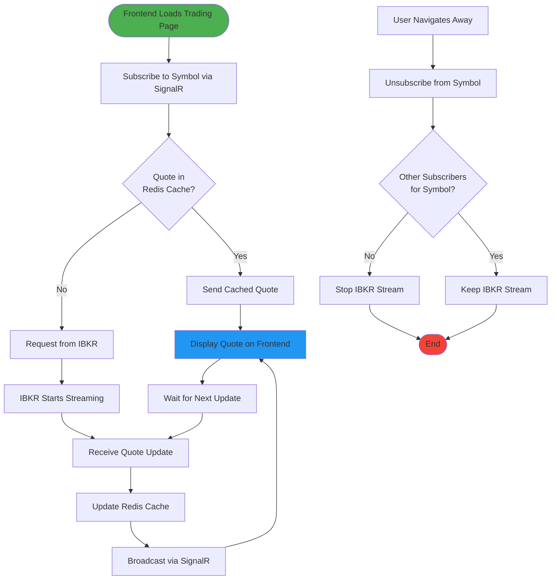

### 3.4 Authentication Flow

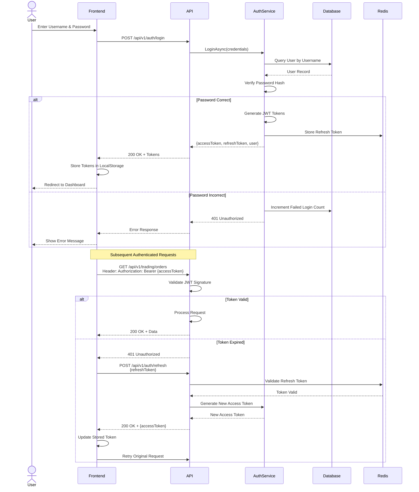

---

## 4. Sequence Diagrams

### 4.1 Backtest Execution

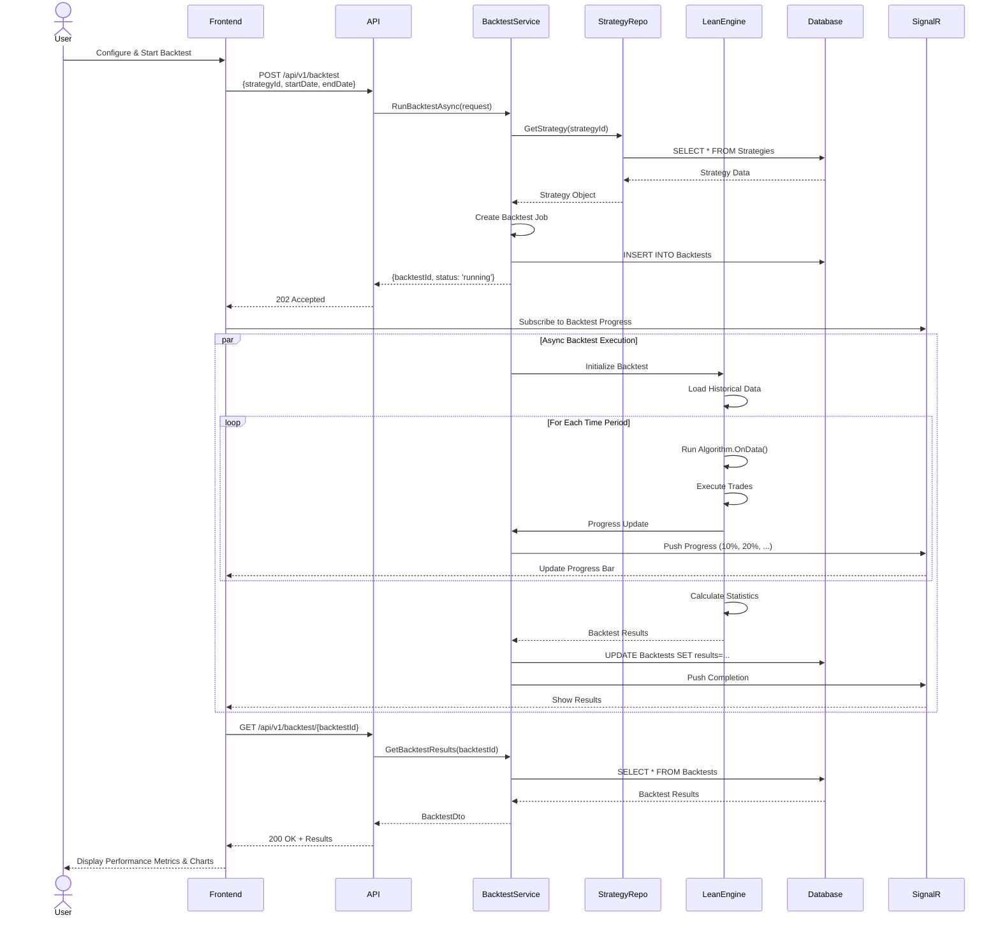

### 4.2 Risk Control Violation

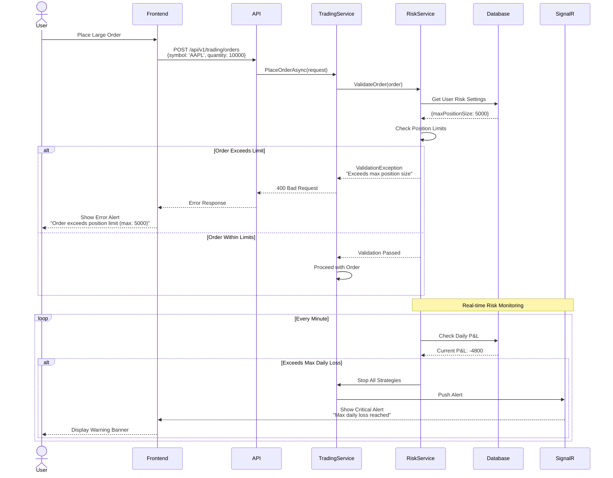

### 4.3 WebSocket Connection Lifecycle

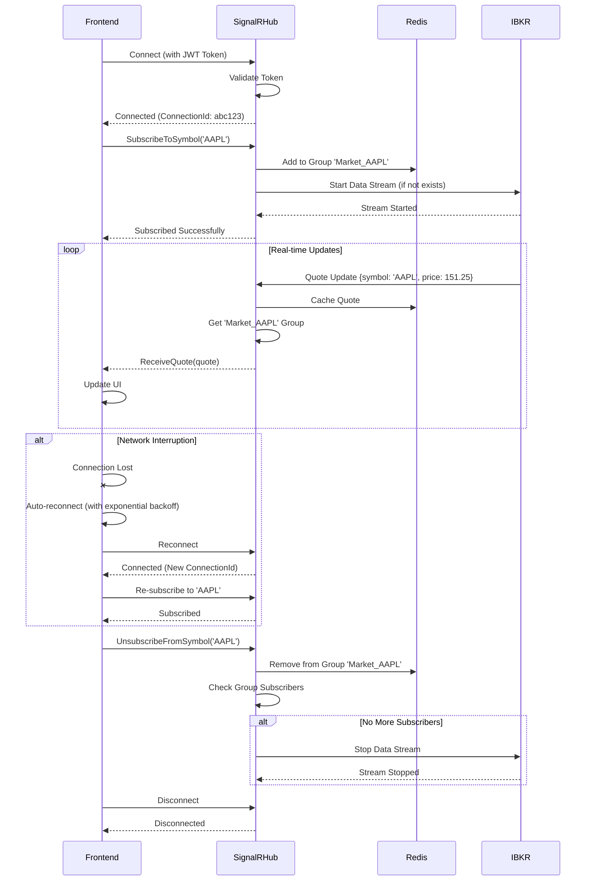

---

## 5. Deployment Diagrams

### 5.1 Docker Compose Deployment

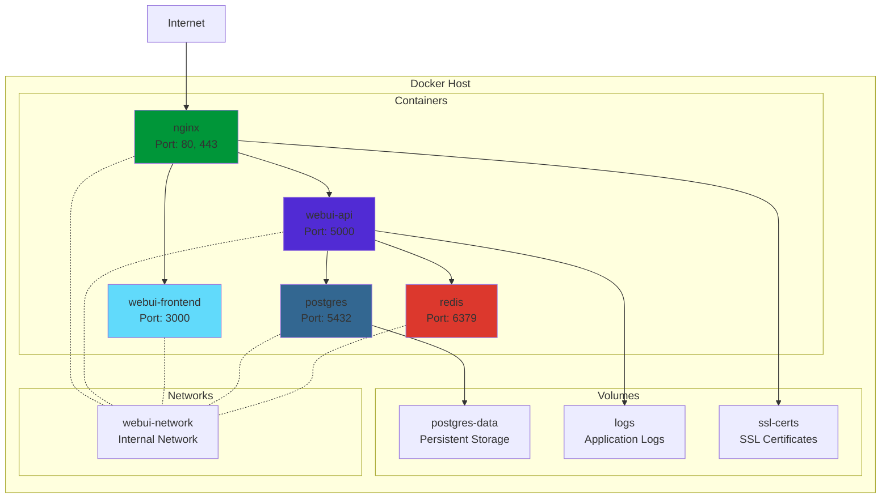

### 5.2 Production Deployment Architecture

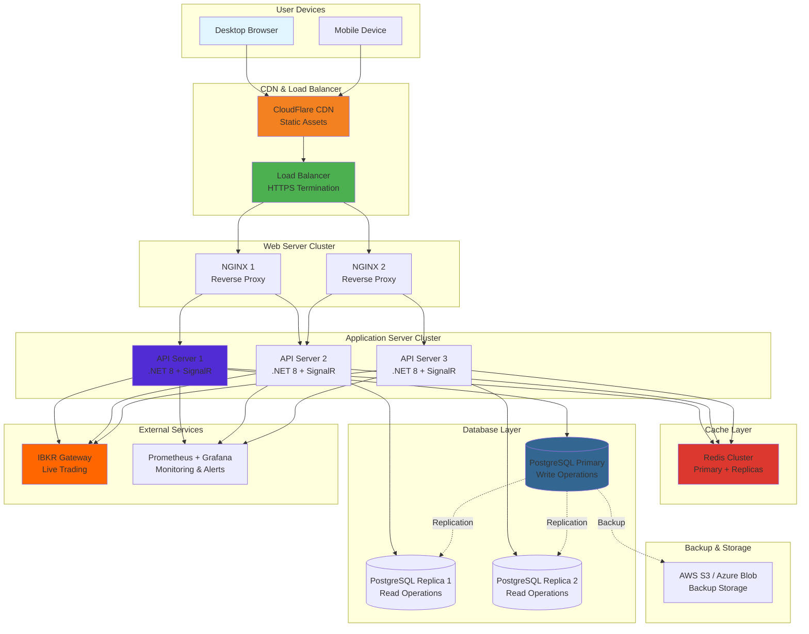

---

## 6. Database Schema

### 6.1 Entity Relationship Diagram

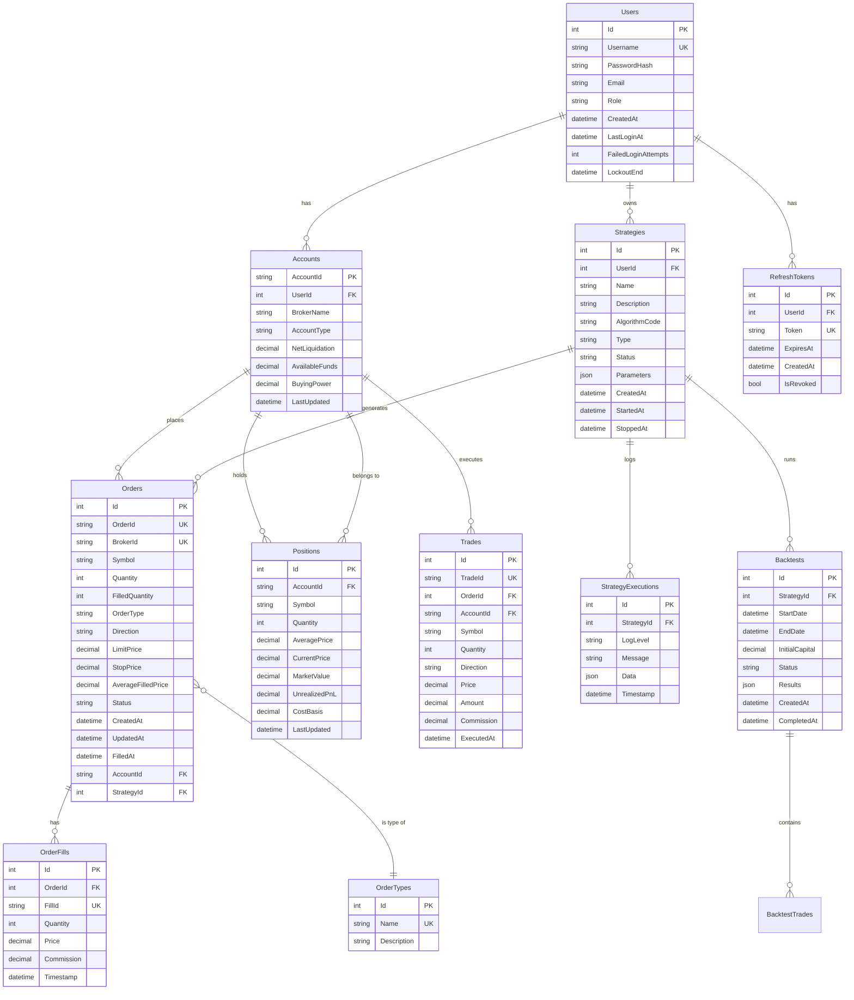

### 6.2 Database Index Strategy

```mermaid
graph TD
    subgraph "High-Frequency Query Tables"
        Orders[Orders Table<br/>~100K rows/day]
        Positions[Positions Table<br/>~1K rows]
        Trades[Trades Table<br/>~200K rows/day]
    end
    
    subgraph "Index Strategy"
        PK[Primary Key Indexes<br/>Auto-created]
        
        OrderIndexes[Orders Indexes:<br/>- AccountId<br/>- Symbol<br/>- Status<br/>- CreatedAt<br/>- (AccountId, CreatedAt) Composite]
        
        PositionIndexes[Positions Indexes:<br/>- AccountId<br/>- Symbol<br/>- (AccountId, Symbol) UK]
        
        TradeIndexes[Trades Indexes:<br/>- AccountId<br/>- Symbol<br/>- ExecutedAt<br/>- (AccountId, ExecutedAt) Composite]
        
        StrategyIndexes[Strategies Indexes:<br/>- UserId<br/>- Status<br/>- (UserId, Status) Composite]
    end
    
    subgraph "Query Optimization"
        CoveringIndex[Covering Indexes<br/>Include columns in index]
        Partitioning[Table Partitioning<br/>By date for large tables]
        Stats[Statistics Updates<br/>Regular ANALYZE/UPDATE STATISTICS]
    end
    
    Orders --> OrderIndexes
    Positions --> PositionIndexes
    Trades --> TradeIndexes
    
    OrderIndexes --> CoveringIndex
    TradeIndexes --> Partitioning
    
    PK --> Stats
    OrderIndexes --> Stats
    
    style Orders fill:#ff9800
    style OrderIndexes fill:#4caf50
    style CoveringIndex fill:#2196f3
```

---

## 7. Security Architecture

### 7.1 Security Layers

```mermaid
graph TB
    subgraph "Network Security"
        Firewall[Firewall<br/>Allow: 80, 443<br/>Block: All Others]
        WAF[Web Application Firewall<br/>OWASP Top 10 Protection]
        DDoS[DDoS Protection<br/>CloudFlare]
    end
    
    subgraph "Transport Security"
        TLS[TLS 1.3<br/>Strong Cipher Suites]
        HSTS[HSTS Header<br/>Force HTTPS]
        Cert[SSL Certificate<br/>Let's Encrypt / DigiCert]
    end
    
    subgraph "Application Security"
        Auth[JWT Authentication<br/>RS256 Signing]
        RBAC[Role-Based Access Control<br/>User/Admin Roles]
        RateLimit[Rate Limiting<br/>60 req/min per user]
        CORS[CORS Policy<br/>Whitelist Origins]
    end
    
    subgraph "Data Security"
        Encryption[Data at Rest Encryption<br/>AES-256]
        Hashing[Password Hashing<br/>PBKDF2 (10K iterations)]
        InputVal[Input Validation<br/>FluentValidation]
        SQLPrev[SQL Injection Prevention<br/>Parameterized Queries]
    end
    
    subgraph "Monitoring & Audit"
        Logging[Structured Logging<br/>Serilog]
        AuditLog[Audit Trail<br/>All Critical Operations]
        Alerts[Security Alerts<br/>Failed Login, Unusual Activity]
    end
    
    Internet[Internet] --> DDoS
    DDoS --> WAF
    WAF --> Firewall
    
    Firewall --> TLS
    TLS --> HSTS
    HSTS --> Cert
    
    Cert --> Auth
    Auth --> RBAC
    RBAC --> RateLimit
    RateLimit --> CORS
    
    CORS --> Encryption
    Encryption --> Hashing
    Hashing --> InputVal
    InputVal --> SQLPrev
    
    SQLPrev --> Logging
    Logging --> AuditLog
    AuditLog --> Alerts
    
    style DDoS fill:#f44336
    style TLS fill:#4caf50
    style Auth fill:#2196f3
    style Encryption fill:#9c27b0
    style Logging fill:#ff9800
```

---

## Appendix: Diagram Rendering

These diagrams are written in **Mermaid** syntax and can be rendered in:

1. **GitHub**: Natively supports Mermaid in Markdown files
2. **VS Code**: Install "Markdown Preview Mermaid Support" extension
3. **Online**: https://mermaid.live/
4. **Documentation Sites**: MkDocs, Docusaurus, GitBook (with Mermaid plugins)

### Example: Rendering in VS Code

1. Install extension: `bierner.markdown-mermaid`
2. Open this file in VS Code
3. Press `Ctrl+Shift+V` (Windows/Linux) or `Cmd+Shift+V` (macOS) to preview
4. Diagrams will render automatically

### Export Options

- **PNG/SVG**: Use Mermaid Live Editor → Export
- **PDF**: VS Code Preview → Print to PDF
- **Embed in Documentation**: Copy diagram code blocks

---

**For more details, refer to:**
- [Mermaid Documentation](https://mermaid.js.org/)
- [Developer Guide](./WebUI-Developer-Guide.md)
- [API Reference](./WebUI-API-Reference.md)

